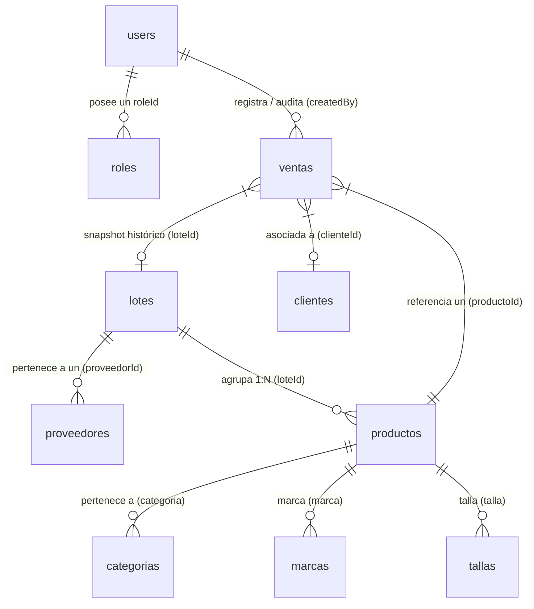

# Diccionario de Datos y Esquema de Firestore — HypeZone Dashboard

Última actualización: **2026-07-24**

Este documento constituye la fuente central de documentación técnica sobre la base de datos Firestore de HypeZone Dashboard. Describe las colecciones, diccionario de datos, tipos, relaciones e integridad del sistema.

---

## 1. Diagrama Entidad-Relación (E-R) y Relaciones

El sistema utiliza **Google Cloud Firestore** (Base de datos NoSQL basada en documentos y colecciones). A nivel lógico, el modelo de datos responde al siguiente esquema relacional:

### Principales Relaciones e Integridad:
1. **`lotes` ── 1:N ── `productos`**: Un lote agrupa múltiples productos (`producto.loteId = lote.id`). La desvinculación usa `deleteField()` sin eliminar físicamente el producto ni la venta.
2. **`productos` ── 1:N ── `ventas`**: Cuando un producto se vende, se genera un documento en `ventas` con `productoId` y se toma un snapshot del estado actual (nombre, precioCompra, precioVenta, loteId).
3. **`users` ── N:1 ── `roles`**: Cada perfil de usuario posee un `roleId` que hace referencia a un documento en `roles/{roleId}`.
4. **`users` ── 1:N ── `effectivePermissions`**: Servidor recalcula y materializa en `users/{uid}` la unión del mapa del rol más `permissionOverrides`.

---

## 2. Diccionario de Datos de Colecciones

### Colección: `users`
- **Ruta Documento:** `users/{uid}` (donde `{uid}` coincide con el UID de Firebase Authentication).
- **Descripción:** Almacena perfiles de usuarios administrativos y sus permisos materializados.

| Campo | Tipo | Requerido | Descripción |
| --- | --- | --- | --- |
| `uid` | `string` | Sí | ID único proveniente de Firebase Auth (Clave Primaria). |
| `email` | `string` | Sí | Correo electrónico institucional o personal del usuario. |
| `displayName` | `string` | Sí | Nombre completo del usuario. |
| `roleId` | `string` | Sí | ID del rol asignado (`owner`, `admin`, `seller`). Ref: `roles/{roleId}`. |
| `role` | `string` | No | Campo legacy de transición (obsoleto). |
| `active` | `boolean` | Sí | Estado del usuario. `false` bloquea el inicio de sesión. |
| `permissionOverrides` | `map` | No | Mapa clave-valor `{ [PermissionKey]: boolean }` con permisos concedidos/denegados explícitamente. |
| `effectivePermissions` | `map` | Sí | Mapa consolidado recalculado en servidor `{ [PermissionKey]: boolean }`. Usado por `firestore.rules`. |
| `protectedOwner` | `boolean` | No | `true` si es el owner principal (impide degradación o desactivación). |
| `createdBy` | `string` | No | UID del usuario creador. |
| `updatedBy` | `string` | No | UID del último usuario que modificó el perfil. |
| `createdAt` | `timestamp` | Sí | Fecha de creación (`serverTimestamp()`). |
| `updatedAt` | `timestamp` | Sí | Fecha de última actualización (`serverTimestamp()`). |

---

### Colección: `roles`
- **Ruta Documento:** `roles/{roleId}` (IDs canónicos: `owner`, `admin`, `seller`).
- **Descripción:** Almacena la plantilla de permisos por defecto para cada rol del sistema.

| Campo | Tipo | Requerido | Descripción |
| --- | --- | --- | --- |
| `name` | `string` | Sí | Nombre descriptivo del rol (ej. "Propietario", "Administrador"). |
| `description` | `string` | No | Explicación del alcance del rol. |
| `active` | `boolean` | Sí | Indica si el rol está disponible en el sistema. |
| `system` | `boolean` | Sí | `true` para roles del sistema (evita borrado físico). |
| `permissions` | `map` | Sí | Mapa clave-valor con los permisos por defecto del rol. |
| `createdAt` | `timestamp` | Sí | Fecha de creación. |
| `updatedAt` | `timestamp` | Sí | Fecha de actualización. |

---

### Colección: `productos`
- **Ruta Documento:** `productos/{id}`
- **Descripción:** Inventario de prendas de vestir y calzado.

| Campo | Tipo | Requerido | Descripción |
| --- | --- | --- | --- |
| `id` | `string` | Auto | ID autogenerado por Firestore. |
| `schemaVersion` | `number` | Sí | Versión del esquema del documento (actual: `3`). |
| `loteId` | `string` | No | FK referenciando a `lotes/{id}`. |
| `nombre` | `string` | Sí | Nombre o título del producto. |
| `marca` | `string` | No | Marca del producto (ej. "Nike", "Adidas"). |
| `categoria` | `string` | Sí | Categoría (`zapatillas`, `polera`, `chompa`, `canguro`, `pantalon`, `camisa`, `short`, `accesorio`, `otro`). |
| `descripcion` | `string` | Sí | Detalle o características del producto. |
| `talla` | `string` | Sí | Talla de la prenda o calzado (`XS`, `S`, `M`, `L`, `XL`, `38`, `40`, etc.). |
| `color` | `string` | No | Color principal del producto. |
| `genero` | `string` | No | Público objetivo (`hombre`, `mujer`, `unisex`, `nino`, `nina`). |
| `precioCompra` | `number` | Sí | Costo de adquisición en Bs. |
| `precioVenta` | `number` | Sí | Precio de venta al público en Bs. |
| `precioOferta` | `number` | No | Precio promocional con descuento (opcional). |
| `estado` | `string` | Sí | Estado operativo (`disponible`, `reservado`, `vendido`, `agotado`). |
| `imagenes` | `array<string>` | Sí | Array de URLs públicas de imágenes alojadas en Cloudinary. |
| `codigo` | `string` | No | Código interno o SKU. |
| `notas` | `string` | No | Observaciones internas. |
| `activo` | `boolean` | Sí | Borrado lógico: `true` visible, `false` desactivado/oculto. |
| `createdAt` | `timestamp` | Sí | Fecha de creación. |
| `updatedAt` | `timestamp` | Sí | Fecha de actualización. |

---

### Colección: `lotes`
- **Ruta Documento:** `lotes/{id}`
- **Descripción:** Agrupación de compras por paquete o importación de prendas.

| Campo | Tipo | Requerido | Descripción |
| --- | --- | --- | --- |
| `id` | `string` | Auto | ID autogenerado por Firestore. |
| `schemaVersion` | `number` | No | Versión del esquema. |
| `nombre` | `string` | Sí | Nombre o código identificador del lote. |
| `descripcion` | `string` | No | Detalle del lote o paquete de ropa. |
| `fechaCompra` | `timestamp/string`| Sí | Fecha en la que se adquirió el lote. |
| `proveedorId` | `string` | No | FK referenciando a `proveedores/{id}`. |
| `proveedor` | `string` | No | Nombre del proveedor (denormalizado para lectura rápida). |
| `lugarCompra` | `string` | No | Origen o ciudad de compra. |
| `costoTotal` | `number` | Sí | Monto global invertido en el lote en Bs. |
| `cantidadProductos`| `number` | No | Campo legacy (el conteo real se realiza dinámicamente sobre `productos`). |
| `notas` | `string` | No | Notas adicionales. |
| `activo` | `boolean` | Sí | Borrado lógico: `true` activo, `false` desactivado. |
| `createdAt` | `timestamp` | Sí | Fecha de creación. |
| `updatedAt` | `timestamp` | Sí | Fecha de actualización. |

---

### Colección: `ventas`
- **Ruta Documento:** `ventas/{id}`
- **Descripción:** Registro histórico inmutable de transacciones comerciales.

| Campo | Tipo | Requerido | Descripción |
| --- | --- | --- | --- |
| `id` | `string` | Auto | ID autogenerado por Firestore. |
| `schemaVersion` | `number` | No | Versión del esquema. |
| `operacionId` | `string` | No | ID de agrupación si se venden múltiples prendas juntas. |
| `productoId` | `string` | Sí | FK referenciando a `productos/{id}`. |
| `loteId` | `string` | No | Snapshot FK del lote al momento de la venta. |
| `nombreProducto` | `string` | Sí | Snapshot del nombre del producto. |
| `precioCompra` | `number` | Sí | Snapshot del costo al momento de vender en Bs. |
| `precioVenta` | `number` | Sí | Monto final al que se vendió en Bs. |
| `ganancia` | `number` | Sí | Cálculo explícito: `precioVenta - precioCompra`. |
| `clienteId` | `string` | No | FK referenciando a `clientes/{id}`. |
| `clienteNombre` | `string` | No | Snapshot o nombre del comprador. |
| `clienteTelefono` | `string` | No | Teléfono de contacto del cliente. |
| `clienteCi` | `string` | No | Cédula de identidad / Documento del cliente. |
| `metodoPago` | `string` | No | Forma de pago (`efectivo`, `qr`, `transferencia`, `otro`). |
| `fechaVenta` | `string` | Sí | Fecha y hora en que se registró la transacción. |
| `notas` | `string` | No | Observaciones de la transacción. |
| `activo` | `boolean` | Sí | Estado de la venta (las ventas no se borran físicamente). |
| `createdAt` | `timestamp` | Sí | Fecha de creación. |
| `updatedAt` | `timestamp` | Sí | Fecha de actualización. |

---

### Colecciones de Catálogos Secundarios

#### `clientes/{id}`
- `nombreCompleto` (`string`, requerido): Nombre y apellidos.
- `celular` (`string`, requerido): Número celular.
- `ci` (`string`, opcional): Cédula de identidad.
- `activo` (`boolean`): Estado del cliente.

#### `proveedores/{id}`
- `nombreCompleto` (`string`, requerido): Razón social o nombre del proveedor.
- `celular` (`string`, requerido): Contacto directo.
- `direccion` (`string`, opcional): Dirección física.
- `categorias` (`array<string>`): Rubros o categorías que provee.
- `instagram` / `tiktok` (`string`, opcionales): Redes sociales.
- `detalles` (`string`, opcional): Notas sobre calidad o tiempos.
- `activo` (`boolean`): Estado operativo.

#### `categorias/{id}`, `tallas/{id}`
- `nombre` (`string`, requerido): Nombre del ítem de catálogo.
- `activo` (`boolean`): Estado.

#### `marcas/{id}`
- `nombre` (`string`, requerido): Nombre de la marca.
- `imagenUrl` (`string`, opcional): URL pública del logo o foto de la marca alojada en Cloudinary.
- `activo` (`boolean`): Estado operativo.

---

## 3. Matriz de Mapeo con Security Rules (`firestore.rules`)

| Colección | Operación | Permiso requerido en `effectivePermissions` |
| --- | --- | --- |
| `/users/{uid}` | `read` | `users.view` o ser el propio usuario (`request.auth.uid == uid`) |
| `/users/{uid}` | `write` | **Denegado (`false`)** — Exclusivo para Cloud Functions Admin SDK |
| `/roles/{roleId}` | `read` | Usuario autenticado y activo (`activeUser()`) |
| `/roles/{roleId}` | `write` | **Denegado (`false`)** |
| `/productos/{id}` | `read` / `create` / `update` / `delete` | `products.view`, `products.create`, `products.update`, `products.delete` |
| `/lotes/{id}` | `read` / `create` / `update` / `delete` | `lots.view`, `lots.create`, `lots.update`, `lots.delete` |
| `/ventas/{id}` | `read` / `create` / `update` | `sales.view`, `sales.create`, `sales.update` |
| `/ventas/{id}` | `delete` | **Denegado (`false`)** — Prohibido borrado físico |
| `/clientes/{id}` | `read` / `create` / `update` / `delete` | `clients.view`, `clients.create`, `clients.update`, `clients.delete` |
| `/proveedores/{id}` | `read` / `create` / `update` / `delete` | `providers.view`, `providers.create`, `providers.update`, `providers.delete` |
| `/categorias`, `/marcas`, `/tallas` | `read` / `create` / `update` / `delete` | `catalogs.view`, `catalogs.create`, `catalogs.update`, `catalogs.delete` |
